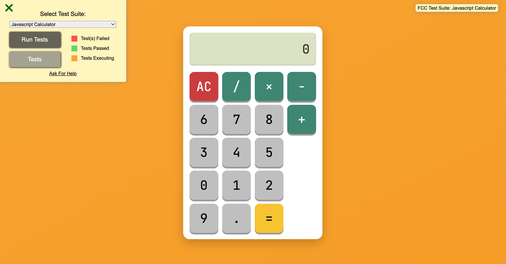

# Calculate me!

This project replicates the core functionality of a basic calculator and satisfies all specified user stories.

---

## 🚀 Setup Instructions

### 1. Clone & Install

```bash
git clone https://github.com/yourusername/javascript-calculator.git
cd javascript-calculator
npm install
npm run dev  # or npm start
```

### 2. Add the FCC Test Script

Add the following line at the end of your `index.html` file, just before the closing `</body>` tag, to enable the FreeCodeCamp test suite:

```html
<script src="https://cdn.freecodecamp.org/testable-projects-fcc/v1/bundle.js"></script>
```

---

## 🎯 Features & Completed User Stories

| User Story | Description                                                       |
|------------|------------------------------------------------------------------|
| #1–#6      | All required buttons and display elements with correct IDs       |
| #7         | Clear button resets calculator                                   |
| #8–#9      | Input is shown on display, and evaluation logic is accurate      |
| #10–#13    | Handles decimal, zero, and operator edge cases correctly         |
| #14        | Starts new expression after "=" with previous result             |
| #15        | Reasonable floating-point precision                              |

---

## ⚙️ Tech Stack

- React (v17 for FCC test compatibility)  
- JavaScript (ES6+)  
- HTML5 + CSS3  
- Optional: SASS, Bootstrap for styling  

---

## 🧪 Testing

Click the green **Run Tests** button provided by the FreeCodeCamp test suite to verify all 15 user stories are passing.

---

## 🖼️ Screenshot




